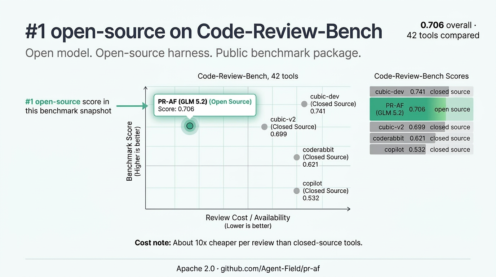
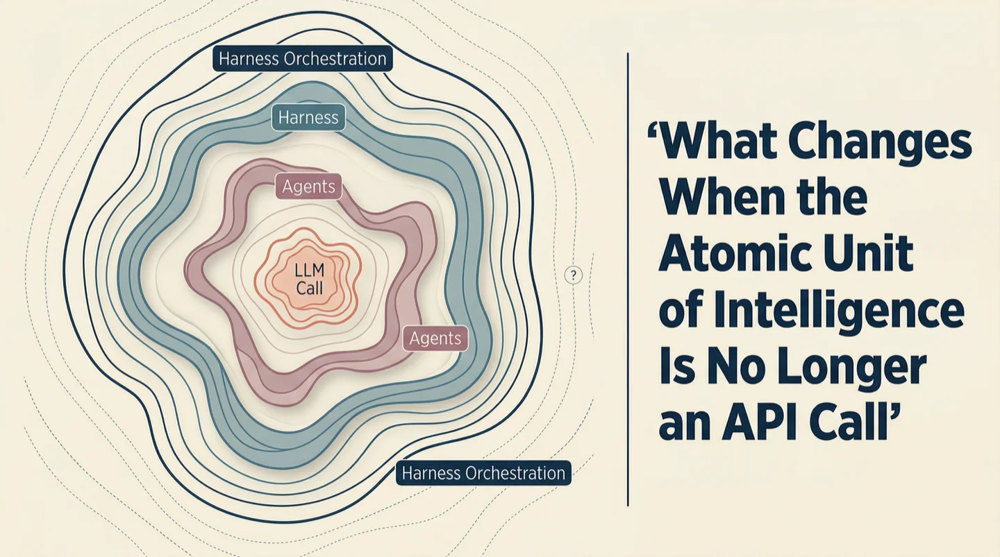
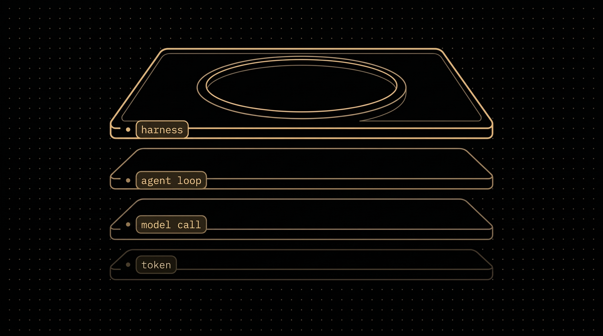
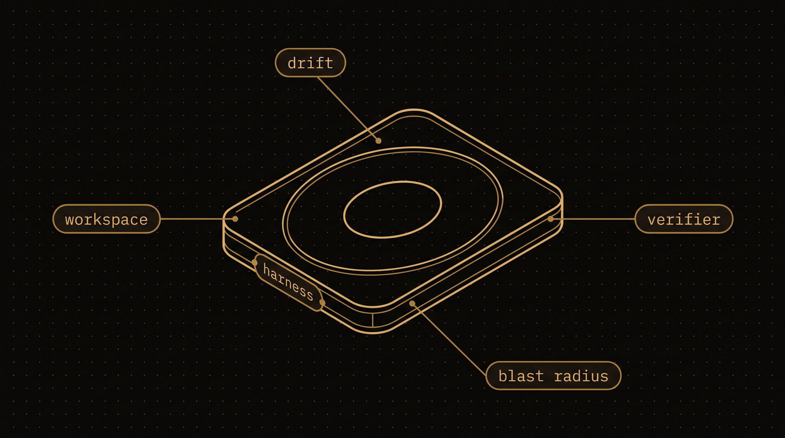
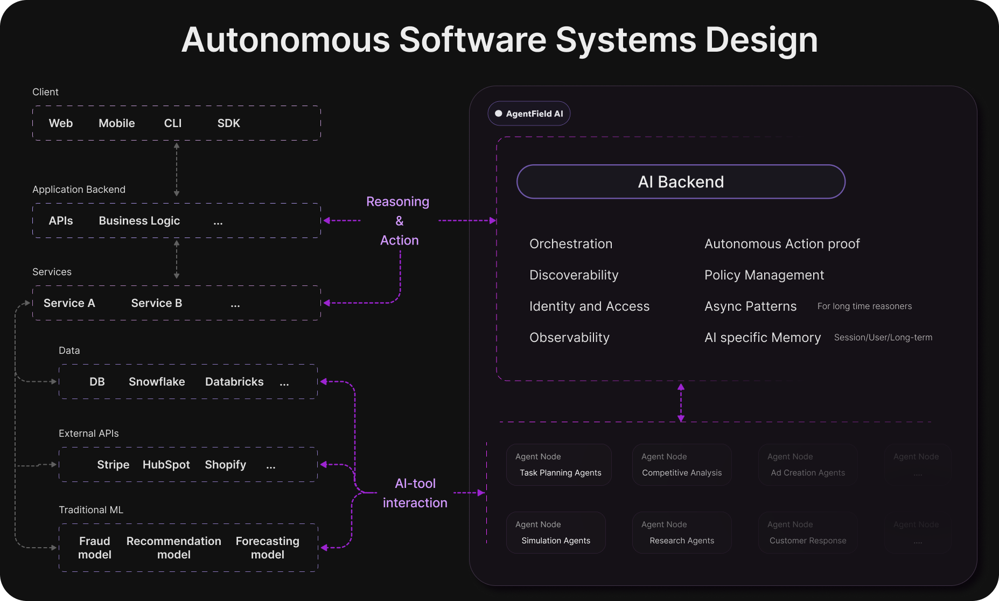

<div align="center">

# AgentField — The AI Backend

### **Build agents like APIs. Run ten thousand of them like microservices.**

*One request fans out to thousands of agents. The control plane queues, retries, and traces every branch.*

[](https://github.com/Agent-Field/agentfield/stargazers)
[](LICENSE)
[](https://github.com/Agent-Field/agentfield)
[](https://github.com/Agent-Field/agentfield/actions/workflows/coverage.yml)
[](https://github.com/Agent-Field/agentfield/commits/main)
[](https://discord.gg/aBHaXMkpqh)

<!-- All outbound agentfield.ai links must use UTM parameters, not direct URLs. See assets/utm-links.csv for the full list — target URLs there are for verification and reference only, always use the UTM version in the README. Update both the README and the CSV when adding or changing links. -->
**[Docs](https://agentfield.ai/docs/learn?utm_source=github-readme&utm_campaign=github-readme&utm_id=github-readme-docs)** · **[Quick Start](https://agentfield.ai/docs/learn/quickstart?utm_source=github-readme&utm_campaign=github-readme&utm_id=github-readme-quickstart)** · **[Python SDK](https://agentfield.ai/docs/reference/sdks/python?utm_source=github-readme&utm_campaign=github-readme&utm_id=github-readme-python-sdk)** · **[Go SDK](https://agentfield.ai/docs/reference/sdks/go?utm_source=github-readme&utm_campaign=github-readme&utm_id=github-readme-go-sdk)** · **[TypeScript SDK](https://agentfield.ai/docs/reference/sdks/typescript?utm_source=github-readme&utm_campaign=github-readme&utm_id=github-readme-typescript-sdk)** · **[REST API](https://agentfield.ai/docs/reference/sdks/rest-api?utm_source=github-readme&utm_campaign=github-readme&utm_id=github-readme-rest-api)** · **[Examples](#built-with-agentfield)** · **[Discord](https://discord.gg/aBHaXMkpqh)**

</div>

<div align="center">
<a href="https://agentfield.ai/docs/build/intelligence/harness?utm_source=github-readme&utm_campaign=github-readme&utm_id=github-readme-harness-banner">

</a>
</div>

AgentField is an open-source control plane that lets you build AI agents callable by any service in your stack - frontends, backends, other agents, cron jobs - just like any other API. You write agent logic in Python, Go, or TypeScript. AgentField turns it into production infrastructure: routing, coordination, memory, async execution, and observability. Every function becomes a REST endpoint, and the same code scales from one agent on your laptop to ten thousand in a single workflow: the control plane handles the fan-out, the queues, and the retries.

<div align="center">

https://github.com/user-attachments/assets/9fb7b1cf-26de-4b9b-9ba2-917252cc26ec

<sub><b>One prompt → a running containerized production ready multi-agent backend.</b> No glue code, start using the agent API!</sub>

</div>

## Build production agents with a prompt.

**Describe the system in one line. Get a production-ready multi-agent backend.** Works in Claude Code, Codex, Gemini CLI, OpenCode, Aider, Windsurf, and Cursor.

```bash
curl -fsSL https://agentfield.ai/install.sh | bash
```

On macOS the installer also registers the control plane to start at login (under
launchd) and adds a menu-bar icon. Stop it with `af service stop` or the menu-bar
icon — a plain `kill` looks like a crash and it restarts. `af service status`
shows health and in-flight work; install with `--no-tray` to skip this entirely.

Then in your coding agent, paste any spec with /agentfield :

```text
/agentfield Build a claims processor with risk scoring, pattern detection,
and human approval for low-confidence decisions.
```

You get a Docker Compose stack wired up end-to-end — the agent, the control plane, and a production ready REST API endpoint you can paste and `curl` into a terminal to try it. [See it in action →](https://agentfield.ai/docs/learn/build-with-claude-code?utm_source=github-readme&utm_campaign=github-readme&utm_id=github-readme-prompt-to-production)

## The DX you get

*Plain Python (or Go / TypeScript) functions. No DSL, no YAML, no graph wiring.*

```python
import asyncio
from agentfield import Agent, AIConfig
from pydantic import BaseModel

app = Agent(
    node_id="researcher",
    version="1.0.0",# Canary deploys, A/B testing, blue-green rollouts
    ai_config=AIConfig(model="anthropic/claude-sonnet-4-20250514"),
)

class SubQuestions(BaseModel):
    questions: list[str]

@app.reasoner(tags=["research"])
async def research(question: str, depth: int = 0, model: str | None = None) -> dict:

    if depth >= 3:  # depth cap keeps fan-out bounded
        answer = await app.ai(system="Answer directly and concisely.", user=question, model=model)
        return {"question": question, "answer": answer}

    # Break the question into sub-questions
    plan = await app.ai(
        system="Break this into 3-5 independent sub-questions.",
        user=question, schema=SubQuestions, model=model,
    )

    # Fan out: each sub-question recurses on this same agent, through the control plane
    branches = await asyncio.gather(*[
        app.call(f"{app.node_id}.research", question=q, depth=depth + 1, model=model)
        for q in plan.questions
    ])

    # Synthesize the branches back into one answer
    synthesis = await app.ai(system="Synthesize these findings.", user=str(branches), model=model)
    return {"question": question, "answer": synthesis, "branches": branches}

app.run()
# This single line exposes: POST /api/v1/execute/researcher.research
# One request fans out to thousands of agents. The control plane queues, retries, and traces
# every branch. No broker, no queue setup, no timeout.
```

> **What you just saw:** `app.ai()` calls an LLM and returns structured output. `app.call()` routes to other agents (or back to itself) through the control plane, so recursion becomes distributed fan-out. `asyncio.gather()` runs every branch in parallel. `app.run()` auto-exposes everything as REST. [Read the full docs →](https://agentfield.ai/docs/learn?utm_source=github-readme&utm_campaign=github-readme&utm_id=github-readme-read-full-docs)

<details>
<summary><b>Need approvals, audit trails, and governance? (the enterprise sample)</b></summary>

```python
from agentfield import Agent, AIConfig
from pydantic import BaseModel

app = Agent(
    node_id="claims-processor",
    version="2.1.0",# Canary deploys, A/B testing, blue-green rollouts
    ai_config=AIConfig(model="anthropic/claude-sonnet-4-20250514"),
)

class Decision(BaseModel):
    action: str# "approve", "deny", "escalate"
    confidence: float
    reasoning: str

@app.reasoner(tags=["insurance", "critical"])
async def evaluate_claim(claim: dict) -> dict:

    # Structured AI judgment - returns typed Pydantic output
    decision = await app.ai(
        system="Insurance claims adjuster. Evaluate and decide.",
        user=f"Claim #{claim['id']}: {claim['description']}",
        schema=Decision,
    )

    if decision.confidence < 0.85:
        # Human approval - suspends execution, notifies via webhook, resumes when approved
        await app.pause(
            approval_request_id=f"claim-{claim['id']}",
            approval_request_url=f"https://internal.acme.com/approvals/claim-{claim['id']}",
            expires_in_hours=48,
        )

    # Route to the next agent - traced through the control plane
    await app.call("notifier.send_decision", input={
        "claim_id": claim["id"],
        "decision": decision.model_dump(),
    })

    return decision.model_dump()

app.run()
# This single line exposes: POST /api/v1/execute/claims-processor.evaluate_claim
# The agent auto-registers with the control plane, gets a cryptographic identity, and every
# execution produces a verifiable, tamper-proof audit trail.
```

> **What you just saw:** `app.ai()` calls an LLM and returns structured output. `app.pause()` suspends for [human approval](https://agentfield.ai/docs/build/execution/human-in-the-loop?utm_source=github-readme&utm_campaign=github-readme&utm_id=github-readme-human-in-the-loop). `app.call()` routes to other agents through the control plane. `app.run()` auto-exposes everything as REST. [Read the full docs →](https://agentfield.ai/docs/learn?utm_source=github-readme&utm_campaign=github-readme&utm_id=github-readme-read-full-docs)

</details>

<details>
<summary><b>Prefer to scaffold by hand? (Python / Go / TypeScript / Docker)</b></summary>

```bash
af init my-agent --defaults                            # Scaffold agent
cd my-agent && pip install -r requirements.txt
af server          # Terminal 1 → Dashboard at http://localhost:8080
python main.py     # Terminal 2 → Agent auto-registers
```

```bash
# Call your agent
curl -X POST http://localhost:8080/api/v1/execute/my-agent.demo_echo \
  -H "Content-Type: application/json" \
  -d '{"input": {"message": "Hello!"}}'
```

```bash
# Go
af init my-agent --defaults --language go && cd my-agent && go run .

# TypeScript
af init my-agent --defaults --language typescript && cd my-agent && npm install && npm run dev

# Docker (control plane only)
docker run -p 8080:8080 agentfield/control-plane:latest
```

[Deployment guide →](https://agentfield.ai/docs/reference/deploy?utm_source=github-readme&utm_campaign=github-readme&utm_id=github-readme-deploy) for Docker Compose, Kubernetes, and production setups.

</details>

## See it in action

<!-- TODO: replace static UI.png with a short gif of a live fan-out run in the DAG view -->

<div align="center">

<br/>
<sub>Real-time workflow DAGs · Execution traces · Agent fleet management · Audit trails</sub>
</div>

## How AgentField fits in your stack

Most agent tools help you **write** agent logic. AgentField is what **runs** it in production: the layer that makes agents callable by other software, durable across failures, and observable when one request fans out to a thousand branches. Keep the framework you already use for authoring; a reasoner is a plain function, so existing LangGraph or CrewAI code can run inside one.

|  | **Frameworks**<br><sub>LangChain · CrewAI · PydanticAI · OpenAI Agents SDK</sub> | **Workflow engines**<br><sub>Temporal · Airflow</sub> | **Visual builders**<br><sub>n8n · Zapier</sub> | **AgentField** |
|---|:-:|:-:|:-:|:-:|
| Build agent logic (prompts, tools, structured output) | ● | — | — | ● |
| Prebuilt chains, retrievers, integrations | ● | — | ◐ | [◐](https://agentfield.ai/docs/integrations?utm_source=github-readme&utm_campaign=github-readme&utm_id=github-readme-integrations) |
| Production REST APIs out of the box | — | ◐ | ● | ● |
| Async + retries + webhooks | — | ● | ◐ | **●** |
| Memory scopes (global · actor · session · workflow) | ◐ | — | — | ● |
| Service discovery + cross-agent calls | — | — | — | **●** |
| Distributed agents (register from anywhere, one mesh) | — | ◐ | — | **●** |
| Coding agents as functions (Claude Code · Codex · CLI) | — | — | — | **●** |
| Agent identity, access policies, signed audit trails | — | — | — | ● |
| Fleet observability (DAGs · metrics · traces) | — | ◐ | — | ● |
| Multi-language SDKs (Python · Go · TypeScript) | ◐ | ● | — | ● |

<sub>● full · ◐ partial · — not the focus</sub>

**Prototype in whatever you like. The moment a second service needs to call your agent, put it on AgentField.** That is the point where you would otherwise start writing queues, retries, discovery, and tracing by hand.

[Full comparison & decision guide →](https://agentfield.ai/docs/learn/vs-frameworks?utm_source=github-readme&utm_campaign=github-readme&utm_id=github-readme-vs-frameworks)

## How it scales

The control plane is a stateless Go service. You put more of them behind a load balancer and the fleet grows horizontally. Work lands in a durable PostgreSQL queue with lease-based processing, so a crash or a restart resumes where it left off instead of dropping the job.

| Property | What it means |
|---|---|
| Stateless Go control plane | Horizontal scaling behind a load balancer. Add replicas to add capacity. |
| Durable PostgreSQL queue | Lease-based processing. Jobs survive crashes and restarts. |
| Async execution | Webhooks and SSE, no timeout limits. A single run can go for hours or days. |
| Backpressure | Queue-depth limits and circuit breakers keep a fan-out from overwhelming downstream agents. |
| Routing overhead | Roughly 100-200ms per cross-agent hop. It matters when a branch does little work per hop, so keep hops coarse when latency is tight. |

Two examples already run at this load. The [deep-research engine](https://agentfield.ai/github/deepresearch/?utm_source=github-readme&utm_campaign=github-readme&utm_id=github-readme-deepresearch-repo) fanned out 10,000+ agent invocations in one workflow. The [security auditor](https://agentfield.ai/github/sec-af/?utm_source=github-readme&utm_campaign=github-readme&utm_id=github-readme-sec-af-repo) runs 250 coordinated agents per audit.

[Deployment guide →](https://agentfield.ai/docs/reference/deploy?utm_source=github-readme&utm_campaign=github-readme&utm_id=github-readme-deploy-scale) for Docker Compose, Kubernetes, and production setups.

## What You Get

**Build** - Python, Go, or TypeScript. Every function becomes a REST endpoint.

- **[Reasoners & Skills](https://agentfield.ai/docs/build/building-blocks/reasoners?utm_source=github-readme&utm_campaign=github-readme&utm_id=github-readme-reasoners)** - `@app.reasoner()` for AI judgment, `@app.skill()` for deterministic code
- **[Structured AI](https://agentfield.ai/docs/reference/sdks/python?utm_source=github-readme&utm_campaign=github-readme&utm_id=github-readme-structured-ai)** - `app.ai(schema=MyModel)` → typed Pydantic/Zod output from any LLM
- **[Harness](https://agentfield.ai/docs/build/intelligence/harness?utm_source=github-readme&utm_campaign=github-readme&utm_id=github-readme-harness)** - `app.harness("Fix the bug")` dispatches multi-turn tasks to Claude Code, Codex, Gemini CLI, or OpenCode
- **[Cross-Agent Calls](https://agentfield.ai/docs/build/coordination/cross-agent-calls?utm_source=github-readme&utm_campaign=github-readme&utm_id=github-readme-cross-agent-calls)** - `app.call("other-agent.func")` routes through the control plane with full tracing
- **[Discovery](https://agentfield.ai/docs/reference/sdks/python?utm_source=github-readme&utm_campaign=github-readme&utm_id=github-readme-discovery)** - `app.discover(tags=["ml*"])` finds agents and capabilities across the mesh. `tools="discover"` lets LLMs auto-invoke them.
- **[Memory](https://agentfield.ai/docs/build/coordination/shared-memory?utm_source=github-readme&utm_campaign=github-readme&utm_id=github-readme-memory)** - `app.memory.set()` / `.get()` / `.similarity_search()` - KV + vector search, four scopes, no Redis needed

**Scale** - Production infrastructure for non-deterministic AI.

- **[Async Execution](https://agentfield.ai/docs/build/execution/async?utm_source=github-readme&utm_campaign=github-readme&utm_id=github-readme-async-execution)** - Fire-and-forget with webhooks, SSE streaming, retries. No timeout limits - agents run for hours or days.
- **[Canary Deployments](https://agentfield.ai/docs/learn/features?utm_source=github-readme&utm_campaign=github-readme&utm_id=github-readme-canary-deployments)** - Traffic weight routing, A/B testing, blue-green deploys. Roll out agent versions at 5% → 50% → 100%.
- **[Human-in-the-Loop](https://agentfield.ai/docs/build/execution/human-in-the-loop?utm_source=github-readme&utm_campaign=github-readme&utm_id=github-readme-human-in-the-loop)** - `app.pause()` suspends execution for human approval. Crash-safe, durable, audited.
- **[Observability](https://agentfield.ai/docs/learn/features?utm_source=github-readme&utm_campaign=github-readme&utm_id=github-readme-observability)** - Automatic workflow DAGs, Prometheus `/metrics`, structured logs, execution timeline.

**Govern** - IAM for AI agents. Every agent gets a cryptographic identity. Identity, access control, and audit trails - built in.

- **[Cryptographic Identity](https://agentfield.ai/docs/build/governance/identity?utm_source=github-readme&utm_campaign=github-readme&utm_id=github-readme-crypto-identity)** - Every agent gets a W3C DID (decentralized identifier) - not a shared API key. Agents authenticate to each other the way services authenticate with mTLS, but with cryptographic signatures that travel with the agent.
- **[Verifiable Credentials](https://agentfield.ai/docs/build/governance/credentials?utm_source=github-readme&utm_campaign=github-readme&utm_id=github-readme-verifiable-credentials)** - Tamper-proof receipt for every execution. Offline-verifiable: `af vc verify audit.json`.
- **[Policy Enforcement](https://agentfield.ai/docs/build/governance/policy?utm_source=github-readme&utm_campaign=github-readme&utm_id=github-readme-policy-enforcement)** - Tag-based policy gates with cryptographic verification. "Only agents tagged 'finance' can call this" - enforced by infrastructure, not prompts.

[See the full production-ready feature set →](https://agentfield.ai/docs/learn/features?utm_source=github-readme&utm_campaign=github-readme&utm_id=github-readme-full-features)

<div align="center">

</div>

<details>
<summary><h4 align="center">▼ Click to expand full capabilities</h4></summary>

#### AI & LLM

| Feature | How |
|---|---|
| Structured output (Pydantic/Zod) | `app.ai(schema=MyModel)` |
| Multi-turn coding agents | `app.harness("task", provider="claude-code")` |
| LLM auto-discovers agents and tools | `app.ai(tools="discover")` |
| Multimodal (text, image, audio) | `app.ai("Describe", image_url="...")` |
| Streaming responses | `app.ai("...", stream=True)` |
| 100+ LLMs via LiteLLM | `AIConfig(model="anthropic/claude-sonnet-4-20250514")` |
| Temperature, max tokens, format | `app.ai(..., temperature=0.2)` |

#### Agent Mesh & Discovery

| Feature | How |
|---|---|
| Cross-agent calls with tracing | `app.call("agent.func", input={...})` |
| Discover agents by tag (wildcards) | `app.discover(tags=["ml*"])` |
| Discover by health status | `app.discover(health_status="active")` |
| Agent routers (namespacing) | `AgentRouter(prefix="billing")` |
| Auto context propagation | Workflow, session, actor IDs forwarded |
| Parallel agent execution | `asyncio.gather(app.call(...), ...)` |
| Auto-registration on startup | Service mesh with zero config |

#### Execution Engine

| Feature | How |
|---|---|
| Sync execution (REST) | `POST /api/v1/execute/{agent}.{func}` |
| Async (fire-and-forget) | `POST /api/v1/execute/async/{agent}.{func}` |
| Webhooks + HMAC-SHA256 signing | `AsyncConfig(webhook_url="...", secret="...")` |
| SSE streaming (real-time) | `/api/v1/execute/stream/{id}` |
| No timeout limits (hours/days) | Control plane allows unlimited duration |
| Execution polling | `GET /api/v1/executions/{id}` |
| Batch status checks | `POST /api/v1/executions/batch-status` |
| Progress updates mid-execution | Intermediate payloads during long tasks |
| Auto retries + exponential backoff | Transparent - control plane handles |
| Backpressure + queue depth limits | Fair scheduling, circuit breakers |
| Durable queue (PostgreSQL) | Atomic lease-based processing |

#### Memory (Distributed State)

| Feature | How |
|---|---|
| Key-value storage | `app.memory.set(key, value)` / `.get(key)` |
| Vector search (semantic) | `app.memory.similarity_search(embedding, top_k=5)` |
| Four scopes | Global, actor, session, workflow |
| Reactive memory events | `@app.memory.on_change("order_*")` |
| Metadata filtering | Filter stored values by metadata |
| Zero dependencies | Built into control plane - no Redis |

#### Human-in-the-Loop

| Feature | How |
|---|---|
| Durable pause/resume | `await app.pause(reason="...")` |
| Approval workflows with UI | `approval_request_url` for reviewers |
| Configurable timeouts | `expires_in_hours=24` + auto-escalation |
| Crash-safe state | Survives agent restarts |

#### Canary Deployments & Versioning

| Feature | How |
|---|---|
| Traffic weight routing | 5% → 50% → 100% rollouts |
| A/B testing | 50/50 splits with `X-Routed-Version` |
| Blue-green deployments | Instant weight switch, zero downtime |
| Per-version health tracking | Unhealthy versions auto-removed |
| Agent lifecycle states | pending → starting → ready → degraded → offline |

#### Identity & Governance

| Feature | How |
|---|---|
| Cryptographic identity per agent | Auto-generated W3C DID + Ed25519 keys |
| Verifiable Credentials | Tamper-proof receipt per execution |
| Offline VC verification | `af vc verify audit.json` |
| Tag-based access policies | ALLOW/DENY rules on caller → target tags |
| Cryptographically signed requests | Ed25519 signatures on cross-agent calls |
| VC hierarchy (3 tiers) | Platform → Node → Function control |
| Agent notes (audit log) | `app.note("Decision", tags=["critical"])` |
| Non-repudiation | Cryptographic proof of actions |
| Permission request workflows | Auto-created when access denied |

#### Observability & Fleet Management

| Feature | How |
|---|---|
| Automatic DAG visualization | Workflow graphs in dashboard |
| Prometheus metrics | `/metrics` out of the box |
| Structured JSON logging | Automatic from SDK |
| Execution timeline | Chronological decision trace |
| Health checks (K8s-ready) | `/health`, `/ready` endpoints |
| Correlation IDs | `X-Workflow-ID`, `X-Execution-ID` |
| Workflow DAG API | `GET /api/v1/workflows/{id}/dag` |
| Agent heartbeat monitoring | Auto health status transitions |

#### Harness (Multi-turn Coding Agents)

| Feature | How |
|---|---|
| 4 providers | Claude Code, Codex, Gemini CLI, OpenCode |
| Schema-constrained output | `schema=ResultModel` (Pydantic/Zod) |
| Cost capping | `max_budget_usd=3.0` |
| Turn limiting | `max_turns=100` |
| Tool access control | `tools=["Read", "Write", "Bash"]` |
| Environment injection | `env={"KEY": "value"}` |
| System prompt override | `system_prompt="..."` |
| Multi-layer output recovery | Cosmetic repair → retry → full retry |

#### Connector API (Fleet Management)

| Feature | How |
|---|---|
| Remote agent management | `/connector/reasoners` |
| Version traffic control | `/connector/.../weight` |
| Bearer token auth | `AGENTFIELD_CONNECTOR_TOKEN` |
| Air-gapped deployment | Outbound WebSocket only |

#### Developer Experience

| Feature | How |
|---|---|
| CLI scaffolding | `af init my-agent --defaults --language python\|go\|typescript` |
| Local dev with dashboard | `af server` → http://localhost:8080 |
| Hot reload | `af dev` auto-detects changes |
| Auto-REST from decorators | Every `@app.reasoner()` → `POST /api/v1/execute/...` |
| Python, Go, TypeScript SDKs | Native patterns per language |
| MCP server integration | `af add --mcp --url <server>` |
| Zero-setup MCP for AI harnesses | Control plane serves MCP at `<server>/mcp` → [docs](docs/mcp-integration.md) |
| Config storage API | `POST /api/v1/configs/:key` - database-backed |
| Docker + Kubernetes ready | Stateless control plane, horizontal scaling |

[Explore all features in detail →](https://agentfield.ai/docs/learn/features?utm_source=github-readme&utm_campaign=github-readme&utm_id=github-readme-explore-features)

</details>

## Built With AgentField

Each of these is a real, installable agent node. With a control plane running, drop any of them into your setup with a single command — `af install <repo-url>` clones the repo, isolates its dependencies, and registers the node. You're prompted once for shared secrets like `OPENROUTER_API_KEY` (stored encrypted and reused across every node), then the node's reasoners are callable over REST or with `af call`:

```bash
af install https://github.com/Agent-Field/SWE-AF             # autonomous engineering team   → node: swe-planner
af install https://github.com/Agent-Field/sec-af             # security auditor              → node: sec-af
af install https://github.com/Agent-Field/cloudsecurity-af   # cloud / IaC security scanner  → node: cloudsecurity
af install https://github.com/Agent-Field/pr-af              # agentic code review           → node: pr-af

af run swe-planner                                          # start a node (prompts once for required secrets)
af call swe-planner.build --in '{"goal": "Add JWT auth", "repo_url": "https://github.com/user/my-repo"}'
```

Full walkthrough — authoring, installing, and configuring nodes: [Installing agent nodes →](docs/installing-agent-nodes.md).

<table>
  <tr>
    <td align="center" width="50%">
      <a href="https://agentfield.ai/github/swe-af/?utm_source=github-readme&utm_campaign=github-readme&utm_id=github-readme-swe-af-repo">
        
      </a>
      <br/>
      <b>Autonomous Engineering Team</b>
      <br/>
      <sub>One API call spins up PM, architect, coders, QA, reviewers - hundreds of coordinated agents that plan, build, test, and ship.</sub>
      <br/><br/>
      <a href="https://agentfield.ai/github/swe-af/?utm_source=github-readme&utm_campaign=github-readme&utm_id=github-readme-swe-af-repo">View project →</a>
    </td>
    <td align="center" width="50%">
      <a href="https://agentfield.ai/github/deepresearch/?utm_source=github-readme&utm_campaign=github-readme&utm_id=github-readme-deepresearch-repo">
        
      </a>
      <br/>
      <b>Deep Research Engine</b>
      <br/>
      <sub>Recursive research backend. Spawns parallel agents, evaluates quality, generates deeper agents, and recurses -10,000+ agents per query.</sub>
      <br/><br/>
      <a href="https://agentfield.ai/github/deepresearch/?utm_source=github-readme&utm_campaign=github-readme&utm_id=github-readme-deepresearch-repo">View project →</a>
    </td>
  </tr>
  <tr>
    <td align="center" width="50%">
      <a href="https://agentfield.ai/github/mongodb/?utm_source=github-readme&utm_campaign=github-readme&utm_id=github-readme-mongodb-repo">
        
      </a>
      <br/>
      <b>Reactive MongoDB Intelligence</b>
      <br/>
      <sub>Atlas Triggers + agent reasoning. Documents arrive raw and leave enriched - risk scores, pattern detection, evidence chains.</sub>
      <br/><br/>
      <a href="https://agentfield.ai/github/mongodb/?utm_source=github-readme&utm_campaign=github-readme&utm_id=github-readme-mongodb-repo">View project →</a>
    </td>
    <td align="center" width="50%">
      <a href="https://agentfield.ai/github/sec-af/?utm_source=github-readme&utm_campaign=github-readme&utm_id=github-readme-sec-af-repo">
        
      </a>
      <br/>
      <b>Autonomous Security Audit</b>
      <br/>
      <sub>250 coordinated agents trace every vulnerability source-to-sink and adversarially verify each finding. Confirmed exploits, not pattern flags.</sub>
      <br/><br/>
      <a href="https://agentfield.ai/github/sec-af/?utm_source=github-readme&utm_campaign=github-readme&utm_id=github-readme-sec-af-repo">View project →</a>
    </td>
  </tr>
  <tr>
    <td align="center" width="50%">
      <a href="https://agentfield.ai/github/cloudsecurity/?utm_source=github-readme&utm_campaign=github-readme&utm_content=cloudsec&utm_id=github-readme-cloudsec-repo">
        
      </a>
      <br/>
      <b>CloudSecurity AF</b>
      <br/>
      <sub>AI-native cloud infrastructure security scanner that performs shift-left attack path analysis directly from IaC, prioritizing the most dangerous risk chains before deployment.</sub>
      <br/><br/>
      <a href="https://agentfield.ai/github/cloudsecurity/?utm_source=github-readme&utm_campaign=github-readme&utm_content=cloudsec&utm_id=github-readme-cloudsec-repo">View project →</a>
    </td>
    <td align="center" width="50%">
      <a href="https://agentfield.ai/github/pr-af/?utm_source=github-readme&utm_campaign=github-readme&utm_id=github-readme-pr-af-repo">
        
      </a>
      <br/>
      <b>Agentic PR Reviewer</b>
      <br/>
      <sub>#1 open-source reviewer on Code-Review-Bench - 0.706 golden recall across 42 tools compared, at ~10x lower cost per review. Builds a custom review strategy for every PR, then adversarially challenges its own findings.</sub>
      <br/><br/>
      <a href="https://agentfield.ai/github/pr-af/?utm_source=github-readme&utm_campaign=github-readme&utm_id=github-readme-pr-af-repo">View project →</a>
    </td>
  </tr>
</table>

[See all examples →](https://agentfield.ai/examples?utm_source=github-readme&utm_campaign=github-readme&utm_id=github-readme-see-all-examples)

Built something with AgentField? [Submit your project to be featured on the examples page](https://github.com/Agent-Field/agentfield/issues/new?template=community-project.md).

## Architecture

<div align="center">

</div>

The control plane is a stateless Go service. Agents connect from anywhere - your laptop, Docker, Kubernetes. They register capabilities, the control plane routes calls between them, tracks execution as DAGs, and enforces policies. [Full architecture docs →](https://agentfield.ai/docs/learn/architecture?utm_source=github-readme&utm_campaign=github-readme&utm_id=github-readme-architecture)

## Learn More

AgentField sends privacy-minimized installation and lifecycle telemetry by default; no prompts or execution payloads are sent. Set `AGENTFIELD_TELEMETRY_ENABLED=false` to disable it. [Telemetry details](docs/ENVIRONMENT_VARIABLES.md#anonymous-telemetry).

The thinking behind AgentField - essays on AI backends, harness orchestration, and the infrastructure production agents actually need.

<table>
  <tr>
    <td align="center" width="50%">
      <a href="https://agentfield.ai/blog/what-is-harness-orchestration?utm_source=github-readme&utm_campaign=github-readme&utm_id=github-readme-blog-what-is-harness-orchestration">
        
      </a>
      <br/>
      <b>What is harness orchestration?</b>
      <br/>
      <sub>The atomic unit of intelligence is climbing from the model call to the autonomous harness - and what changes when it does.</sub>
      <br/><br/>
      <a href="https://agentfield.ai/blog/what-is-harness-orchestration?utm_source=github-readme&utm_campaign=github-readme&utm_id=github-readme-blog-what-is-harness-orchestration">Read post →</a>
    </td>
    <td align="center" width="50%">
      <a href="https://agentfield.ai/blog/harness-as-black-box?utm_source=github-readme&utm_campaign=github-readme&utm_id=github-readme-blog-harness-black-box">
        
      </a>
      <br/>
      <b>Part 1: The Black Box</b>
      <br/>
      <sub>Treating harnesses like Claude Code and Codex as autonomous, embodied, persistent computational entities.</sub>
      <br/><br/>
      <a href="https://agentfield.ai/blog/harness-as-black-box?utm_source=github-readme&utm_campaign=github-readme&utm_id=github-readme-blog-harness-black-box">Read post →</a>
    </td>
  </tr>
  <tr>
    <td align="center" width="50%">
      <a href="https://agentfield.ai/blog/harness-as-membrane?utm_source=github-readme&utm_campaign=github-readme&utm_id=github-readme-blog-harness-membrane">
        
      </a>
      <br/>
      <b>Part 2: Engineering the Membrane</b>
      <br/>
      <sub>Shaping the boundary surface of a harness across four engineerable dimensions: workspace, drift, verifier placement, and recovery budget.</sub>
      <br/><br/>
      <a href="https://agentfield.ai/blog/harness-as-membrane?utm_source=github-readme&utm_campaign=github-readme&utm_id=github-readme-blog-harness-membrane">Read post →</a>
    </td>
    <td align="center" width="50%">
      <a href="https://agentfield.ai/blog/ai-backend?utm_source=github-readme&utm_campaign=github-readme&utm_id=github-readme-blog-ai-backend">
        
      </a>
      <br/>
      <b>The AI Backend</b>
      <br/>
      <sub>Our thesis: in five years every serious software company will run an AI backend - a reasoning layer that makes the decisions that used to be hardcoded.</sub>
      <br/><br/>
      <a href="https://agentfield.ai/blog/ai-backend?utm_source=github-readme&utm_campaign=github-readme&utm_id=github-readme-blog-ai-backend">Read post →</a>
    </td>
  </tr>
  <tr>
    <td align="center" width="50%">
      <b>Fan out 1,000 parallel agents from one request</b>
      <br/>
      <sub>A tutorial on turning a single call into a bounded fan-out across the control plane, with queues, retries, and traces on every branch.</sub>
      <br/><br/>
      <a href="https://agentfield.ai/blog/fan-out-1000-agents?utm_source=github-readme&utm_campaign=github-readme&utm_id=github-readme-blog-fan-out-1000-agents">Read post →</a>
    </td>
    <td align="center" width="50%">
      <b>Claude Code as a function</b>
      <br/>
      <sub>Wrap a multi-turn coding harness behind a REST endpoint and call Claude Code the same way you call any other agent.</sub>
      <br/><br/>
      <a href="https://agentfield.ai/blog/claude-code-as-a-function?utm_source=github-readme&utm_campaign=github-readme&utm_id=github-readme-blog-claude-code-as-a-function">Read post →</a>
    </td>
  </tr>
</table>

### Documentation

- **[vs Agent Frameworks](https://agentfield.ai/docs/learn/vs-frameworks?utm_source=github-readme&utm_campaign=github-readme&utm_id=github-readme-vs-frameworks)** - How AgentField compares to LangChain, CrewAI, and workflow engines
- **[Full Documentation](https://agentfield.ai/docs/learn?utm_source=github-readme&utm_campaign=github-readme&utm_id=github-readme-full-docs)**

## Community

<div align="center">

[](https://discord.gg/aBHaXMkpqh)
[](https://x.com/agentfield_ai)

**[GitHub Issues](https://github.com/Agent-Field/agentfield/issues)** · **[Documentation](https://agentfield.ai/docs/learn?utm_source=github-readme&utm_campaign=github-readme&utm_id=github-readme-community-docs)** · **[Examples](https://agentfield.ai/docs/learn/examples?utm_source=github-readme&utm_campaign=github-readme&utm_id=github-readme-community-examples)**

</div>

## License

[Apache 2.0](LICENSE)
